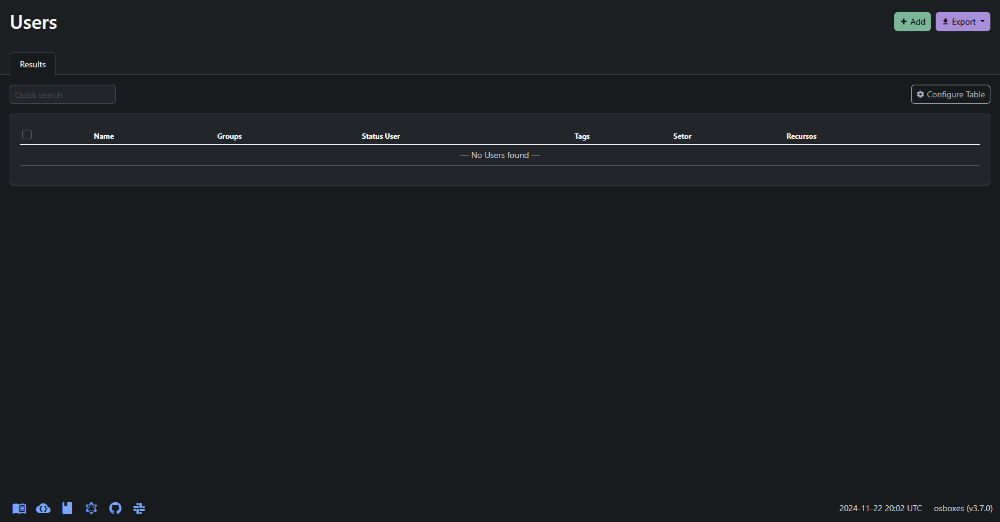

***
# Netbox User
 
## Preview



## Install

Faça o git clone do projeto de preferência aonde o projeto do netbox se encontra:

```
git clone <project_netbox_user>
```
Acesse a pasta `plugin_netbox_user/netbox-plugin/`.

Depois rode o ambiente virtual do python dentro do netbox.

```
source /opt/netbox/venv/bin/activate
```

Rode o comando `pip3 install -e .` no ambiente virtual.

### Update

Run `python3 manage.py makemigrations netbox_user`

Run `python3 manage.py migrate`

***